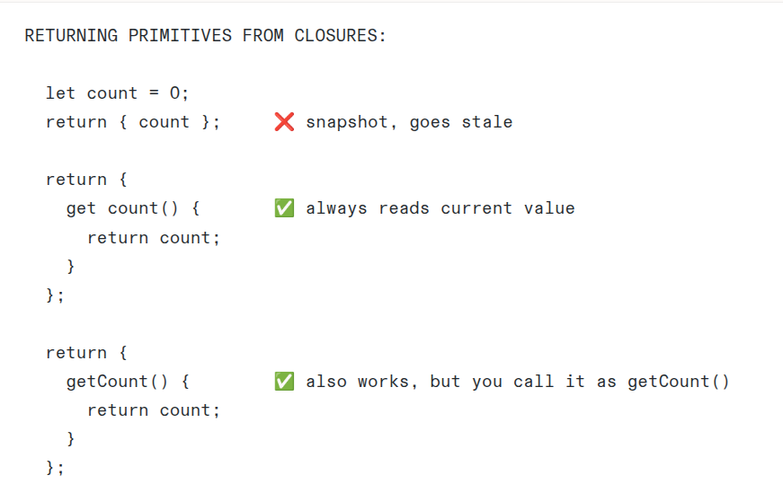
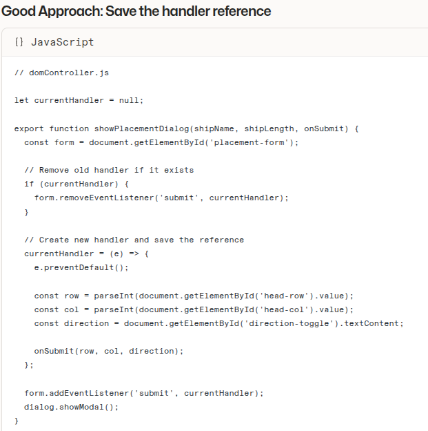

# 1.Returning primitives from closures:

# 2.Put 'bag' and makeRandomMove function inside Player

# 3.Remove old listener:

# 4.There is no 'while' in event trigger! Please use 'if' instead of 'while'

# 5.Event Loop: the submit button is the loop! once you set a listener to 'submit', it stays there unless you remove it. the submit button just have to judge the current index. \*\*\*\*:the submit button 'validates' and 'loops'

# 6.Check curIndex >= 5 BEFORE calling regenerateForm !

# 7.EXTREMELY IMPORTANT: How to pass functions?

The rule:
someFunction <= the function itself (for callbacks)
someFunction() <= CALL the function, get the return value

"Hand me the tool" vs "Use the tool and hand me the result"

# 8.'label.for' Should Be 'label.htmlFor'

False:headLabel.for="...."
Correct:
headLabel.htmlFor="..."

In js, 'for' is a reserved word (for loops). The DOM property is htmlFor
